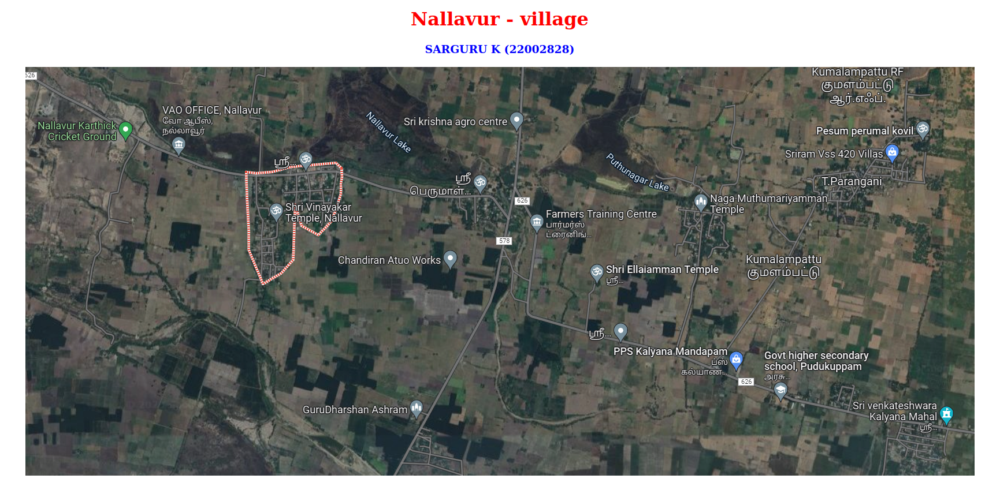
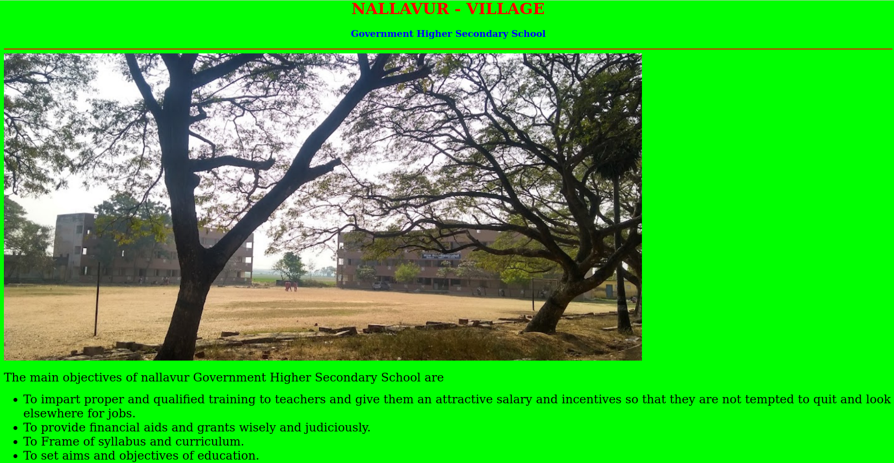
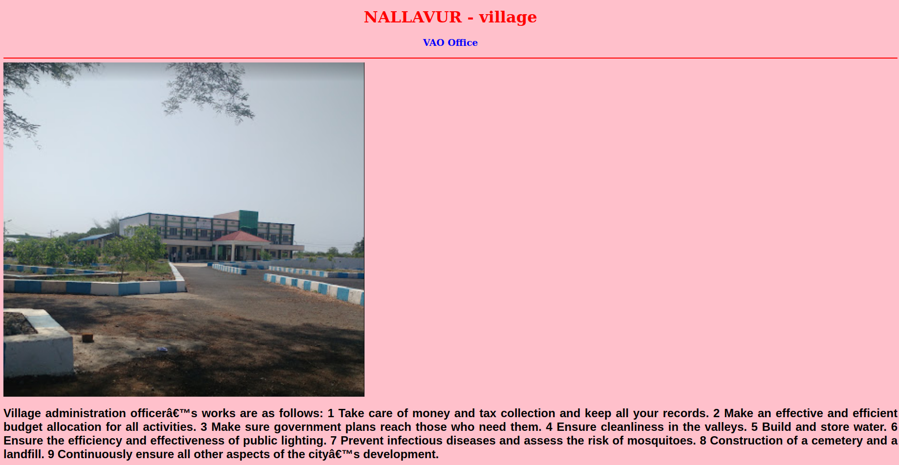
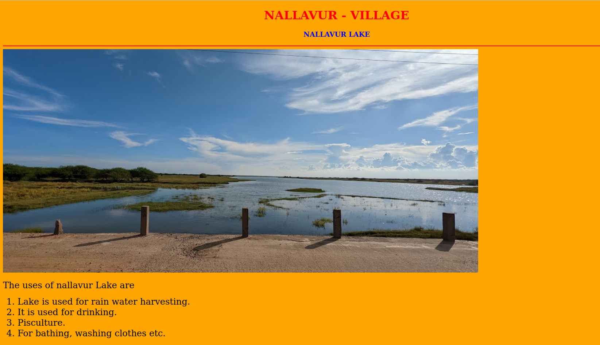
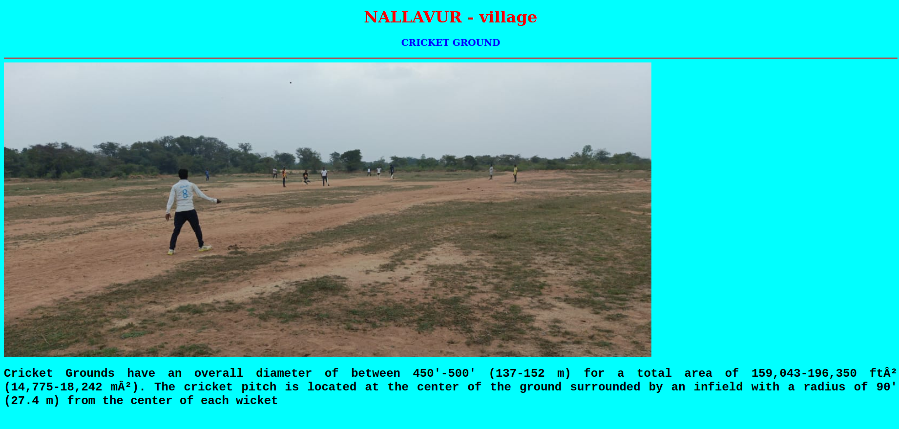
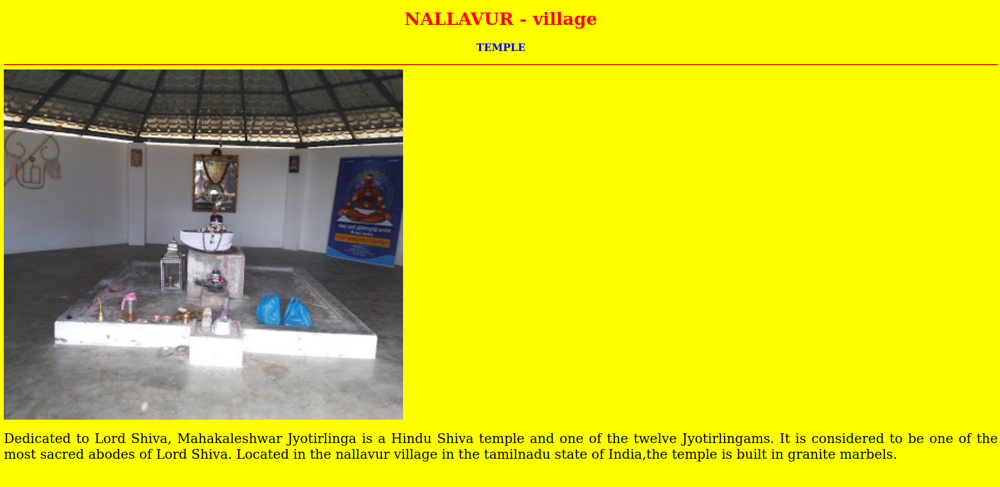

# Places Around Me
## AIM:
To develop a website to display details about the places around my house.

## Design Steps:
## Step 1:
Clone the git repository into Theia IDE.

## Step 2:
Create a new Django project.

## step 3:
Write the needed HTML code.

## step 4:
Run the Django server and execute the HTML files.

## Code:
```
MAP :

<!DOCTYPE html>
<html lang="en">
<head>
<title>MY VILLAGE</title>
</head>
<body>
<h1 align="center">
<font color="red"><b>Nallavur - village</b></font>
</h1>
<h3 align="center">
<font color="blue"><b>SARGURU K (22002828)</b></font>
</h3>
<center>

<map name="MyVillage">
<area shape="circle" coords="190,50,20" href="/static/html/ghs.html" title="Govt. Higher Secondary School">
<area shape="rectangle" coords="230,30,260,60" href="/static/html/vao.html" title="VAO Office">
<area shape="circle" coords="400,350,50" href="/static/html/lake.html" title="Nallavur Lake">
<area shape="circle" coords="400,200,75" href="/static/html/cricketground.html" title="CRICKET GROUND">
<area shape="rectangle" coords="490,150,870,320" href="/static/html/temple.html" title="SIVAN TEMPLE">
</map>
</center>
</body>
</html>

```
```
SCHOOL :

<!DOCTYPE html>
<html lang="en">
<head>
<title>Govt. High. Sec. School</title>
</head>
<body bgcolor="lime">
<h1 align="center">
<font color="red"><b>NALLAVUR - VILLAGE</b></font>
</h1>
<h3 align="center">
<font color="blue"><b>Government Higher Secondary School</b></font>
</h3>
<hr size="3" color="red">

<p align="justify">
<font face="Georgia" size="5">
The main objectives of nallavur Government Higher Secondary School are 
<ul>
<li>To impart proper and qualified training to teachers and give them an attractive salary and incentives so that they are not tempted to quit and look elsewhere for jobs.</li>
<li>To provide financial aids and grants wisely and judiciously.</li>
<li>To Frame of syllabus and curriculum.</li>
<li>To set aims and objectives of education.</li>
</ul>
</font>
</p>
</body>
</html>

```
```

VAO OFFICE :

<!DOCTYPE html>
<html lang="en">
<head>
<title>VAO Office</title>
</head>
<body bgcolor="pink">
<h1 align="center">
<font color="red"><b>NALLAVUR - village</b></font>
</h1>
<h3 align="center">
<font color="blue"><b>VAO Office</b></font>
</h3>
<hr size="3" color="red">

<p align="justify">
<font face="Arial" size="5">
<b>
Village administration officer’s works are as follows:
  1 Take care of money and tax collection and keep all your records.
  2 Make an effective and efficient budget allocation for all activities.
  3 Make sure government plans reach those who need them.
  4 Ensure cleanliness in the valleys.
  5 Build and store water.
  6 Ensure the efficiency and effectiveness of public lighting.
  7 Prevent infectious diseases and assess the risk of mosquitoes.
  8 Construction of a cemetery and a landfill.
  9 Continuously ensure all other aspects of the city’s development.
</b>
</font>
</p>
</body>
</html>

```
```

LAKE :

<!DOCTYPE html>
<html lang="en">
<head>
<title>NALLAVUR LAKE</title>
</head>
<body bgcolor="orange">
<h1 align="center">
<font color="red"><b>NALLAVUR - VILLAGE</b></font>
</h1>
<h3 align="center">
<font color="blue"><b>NALLAVUR LAKE</b></font>
</h3>
<hr size="3" color="red">

<p align="justify">
<font face="Georgia" size="5">
The uses of nallavur Lake are 
<ol type="1">
<li>Lake is used for rain water harvesting.</li>
<li>It is used for drinking.</li>
<li>Pisculture.</li>
<li>For bathing, washing clothes etc.</li>
</ol>
</font>
</p>
</body>
</html>

```
```

CRICKET GROUND :

<!DOCTYPE html>
<html lang="en">
<head>
<title>CRICKET GROUND</title>
</head>
<body bgcolor="cyan">
<h1 align="center">
<font color="red"><b>NALLAVUR - village</b></font>
</h1>
<h3 align="center">
<font color="blue"><b>CRICKET GROUND</b></font>
</h3>
<hr size="3" color="red">

<p align="justify">
<font face="Courier New" size="5">
<b>
Cricket Grounds have an overall diameter of between 450'-500' (137-152 m) 
for a total area of 159,043-196,350 ft² (14,775-18,242 m²). 
The cricket pitch is located at the center of the ground surrounded 
by an infield with a radius of 90' (27.4 m) from the center of each wicket
</b>
</font>
</p>
</body>
</html>
<!DOCTYPE html>
<html lang="en">
<head>
<title>CRICKET GROUND</title>
</head>
<body bgcolor="cyan">
<h1 align="center">
<font color="red"><b>NALLAVUR - village</b></font>
</h1>
<h3 align="center">
<font color="blue"><b>CRICKET GROUND</b></font>
</h3>
<hr size="3" color="red">

<p align="justify">
<font face="Courier New" size="5">
<b>
Cricket Grounds have an overall diameter of between 450'-500' (137-152 m) 
for a total area of 159,043-196,350 ft² (14,775-18,242 m²). 
The cricket pitch is located at the center of the ground surrounded 
by an infield with a radius of 90' (27.4 m) from the center of each wicket
</b>
</font>
</p>
</body>
</html>
<!DOCTYPE html>
<html lang="en">
<head>
<title>CRICKET GROUND</title>
</head>
<body bgcolor="cyan">
<h1 align="center">
<font color="red"><b>NALLAVUR - village</b></font>
</h1>
<h3 align="center">
<font color="blue"><b>CRICKET GROUND</b></font>
</h3>
<hr size="3" color="red">

<p align="justify">
<font face="Courier New" size="5">
<b>
Cricket Grounds have an overall diameter of between 450'-500' (137-152 m) 
for a total area of 159,043-196,350 ft² (14,775-18,242 m²). 
The cricket pitch is located at the center of the ground surrounded 
by an infield with a radius of 90' (27.4 m) from the center of each wicket
</b>
</font>
</p>
</body>
</html>

```
```

TEMPLE :

<!DOCTYPE html>
<html lang="en">
<head>
<title>TEMPLE</title>
</head>
<body bgcolor="yellow">
<h1 align="center">
<font color="red"><b>NALLAVUR - village</b></font>
</h1>
<h3 align="center">
<font color="blue"><b>TEMPLE</b></font>
</h3>
<hr size="3" color="red">

<p align="justify">
<font face="Tahoma" size="5">
Dedicated to Lord Shiva, Mahakaleshwar Jyotirlinga is a Hindu Shiva 
temple and one of the twelve Jyotirlingams. It is considered to be 
one of the most sacred abodes of Lord Shiva. Located in the nallavur 
village  in the tamilnadu state of India,the temple is built in granite marbels.
</font>
</p>
</body>
</html>


```

## Output:













## Result:
Write your result